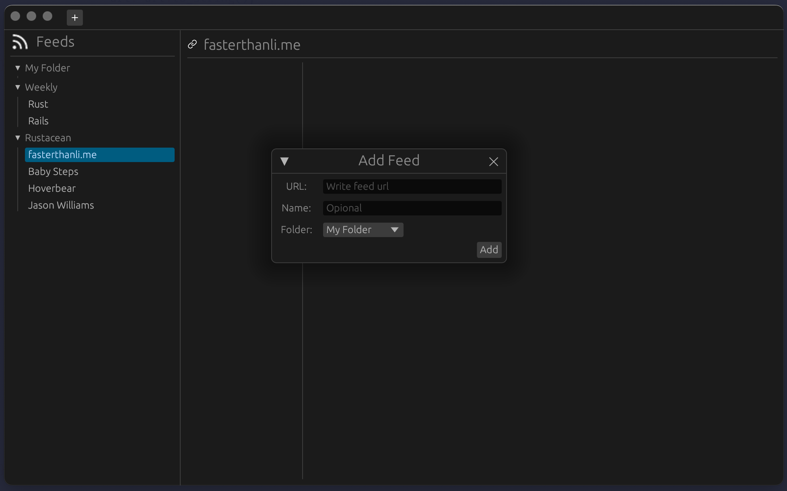

# PinDash News

`News` 是一款阅读器，当前支持 RSS 订阅和阅读，后续会开发更多有意思的功能。



## Repo

https://github.com/pindash-io/News

## Todos

* [ ] PDF

* [ ] 分享到其他知识工具：Affine, Obsidian, Logseq, etc.

* [ ] Web

## Development

```console
$ RUST_LOG=info cargo run
```

## Run

```console
$ RUST_LOG=info cargo run --features="wgpu" --release
```

## Built with

* [egui](https://www.egui.rs/)

* [tokio](https://tokio.rs/)

* [Lucide Icons](https://lucide.dev/)

* etc.

## License

This project is licensed under the [MIT](LICENSE-MIT) OR [Apache-2.0](LICENSE-APACHE).

## Author

- [Mastodon](https://fosstodon.org/@fundon)

- [Twitter](https://twitter.com/_fundon)
